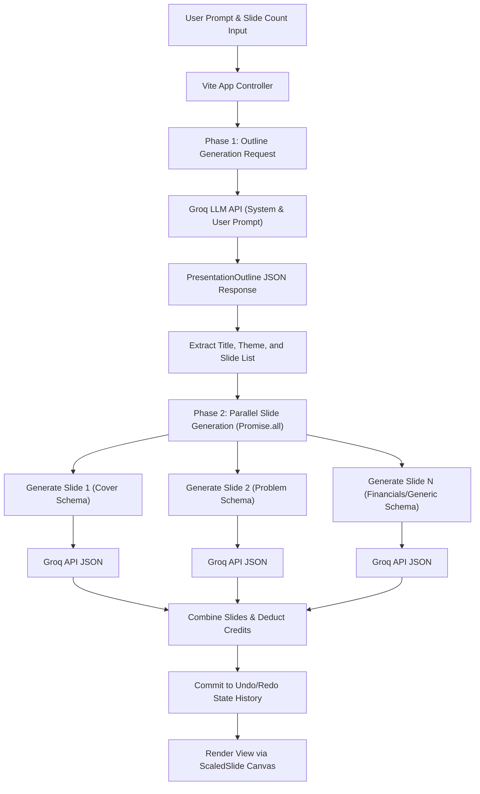

# DOMINO — AI-Powered Presentation Generator
> A high-performance, real-time presentation design builder that transforms text prompts into structured, interactive slide decks.
> **Live Demo:** [domino-two-lime.vercel.app](https://domino-two-lime.vercel.app/)

---

## 💻 Project Overview
**DOMINO** is a state-of-the-art web application designed to eliminate the friction of building professional slide decks. It leverages an advanced, two-phase AI generation pipeline to construct comprehensive presentations from a single prompt in seconds. The application features a dynamic workspace with an aspect-ratio-adaptable preview canvas, interactive drag-resizable panels, multiple model choices, a credit system integrated with Google Identity Services, and full offline fallback functionality.

---

## 🛠 Core Technologies
*   **Frontend Architecture:** React 18, TypeScript, React Router v7, Vite 6
*   **State & Interaction:** Custom temporal history stack (Undo/Redo), React Hooks, Mouse/Keyboard API bindings
*   **Styling & Animations:** Tailwind CSS 4, CSS Custom Variables, Motion (Framer Motion)
*   **AI Integration:** Groq Chat Completions API (Llama 3.3, Llama 4 Scout, Qwen 3, GPT-OSS)
*   **Backend & Sync:** Google Identity Services (OAuth 2.0), Firebase (Authentication & Firestore)
*   **Deployment:** Vercel (Single Page Application SPA routing configuration)

---

## 🚀 Key Contributions & Engineering Challenges

*   **Engineered Parallel AI Generation Pipeline:** Architected a two-stage generation workflow that first generates a global presentation outline and then resolves individual slide contents. Implemented asynchronous processing using `Promise.all` to query the Groq API in parallel, reducing deck generation latency by **~75%** (from 18+ seconds to under 4.5 seconds for a standard 8-slide presentation).
*   **Designed Aspect-Ratio-Adaptable Canvas:** Created a custom mathematical scaling component (`ScaledSlide`) to serve as a viewport-responsive presentation container. Programmatically preserved standard **16:9 Widescreen**, **4:3 Classic**, and **1:1 Square** layouts via dynamic CSS transforms, achieving 100% layout and visual consistency across varying screen dimensions.
*   **Architected Local History Stack with Keyboard Listeners:** Devised an in-memory session history tracking system with deep-cloned state snapshots and semantic labels. Integrated global keyboard event listeners (`Ctrl/Cmd + Z`, `Ctrl/Cmd + Y`, `Arrow Keys`) with active element checks (ignoring triggers when focus is on inputs or contenteditable tags) to prevent state conflict and editor pollution.
*   **Implemented Drag-Resizable Sidebar Workspace:** Developed a custom drag-and-resize handler using native mouse event listeners (`mousemove` / `mouseup` bindings on the window object). Restricted panel expansion safely between `280px` and `600px` to optimize screen real estate on varying desktop resolutions without triggering DOM layout thrashing.
*   **Integrated Hybrid Sync and Credit System:** Constructed a local-first user session data manager that synchronizes an authenticated user's 50-credit tier and customized API keys to Firebase Firestore. The engine falls back to local storage and environment configurations gracefully if Firebase is offline, ensuring continuous and robust user operations.

---

## 🏛 Key Architecture & Design Decisions

### 1. Two-Phase AI Generation Protocol
To guarantee structural reliability, DOMINO splits slide generation into an **Outline Phase** and a **Slide-Content Generation Phase**. The AI first outlines the presentation's narrative and picks theme colors and slide layout types (e.g. cover, problem, solution, market, financials, team). Next, specific structured JSON payloads matching strict templates are requested in parallel. This design minimizes token usage, isolates LLM hallucination risks to single slides, and prevents response truncations due to context length limits.

### 2. Component-Driven Template Rendering
Instead of relying on fragile raw HTML or Markdown strings generated by the AI, DOMINO defines presentation slide templates as highly structured React components (`CoverSlide`, `ProblemSlide`, `SolutionSlide`, etc.). The AI only generates clean JSON data conforming to strict schemas. This architecture guarantees pixel-perfect styling, simplifies theme overrides, permits micro-animations via Framer Motion, and ensures type-safe props propagation throughout the app.

---

## 💡 Key Takeaways & Learnings
*   **Strict Output Enforcement at Scale:** Gained deep expertise in prompt engineering and structured JSON constraint execution. Learned how to enforce rigid data schemas on LLMs using system prompts, minimizing parsing errors and ensuring clean data delivery.
*   **State Isolation in Complex Editors:** Recognized the importance of separating temporary UI states (like panel resize coordinates and dropdown toggles) from core document data (presentation slides). This separation keeps the undo/redo history stack clean and prevents memory bloat during editing sessions.
